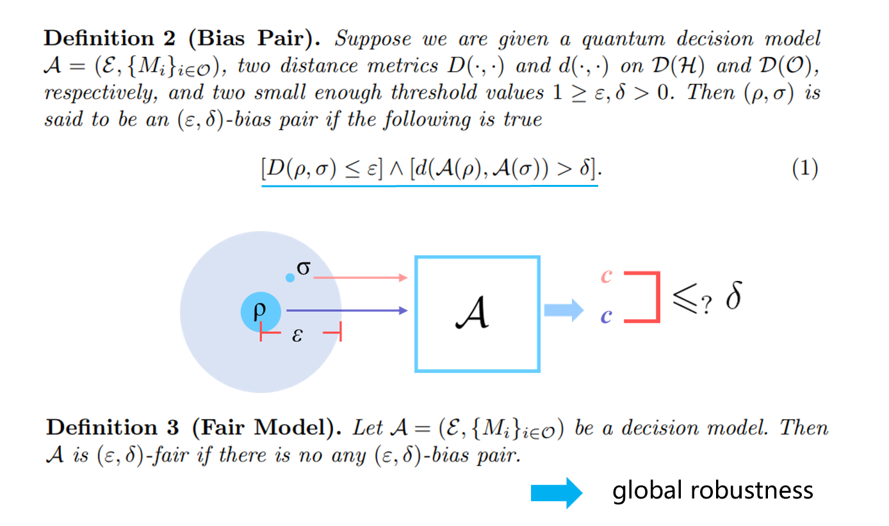
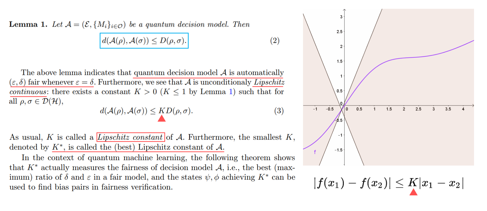
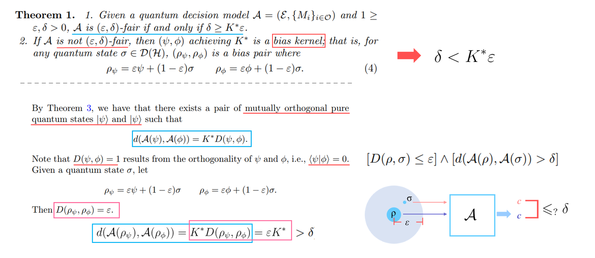
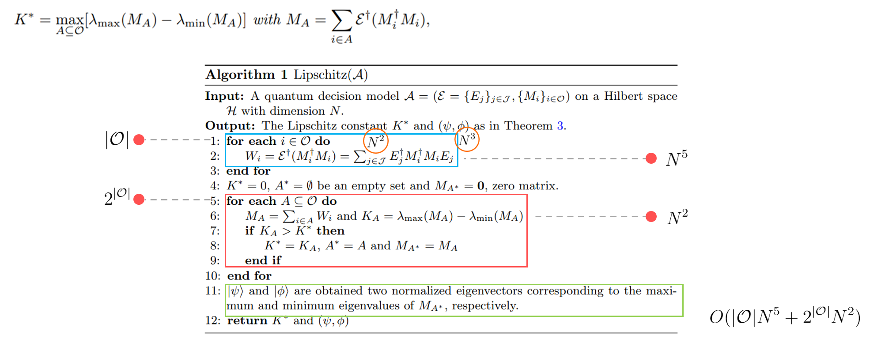
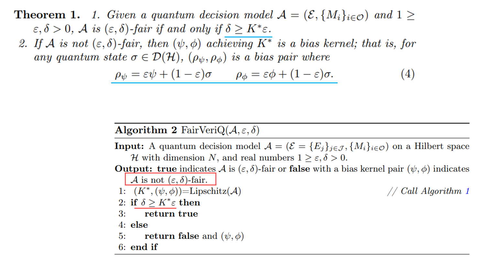

# Quantum Fairness Verification

基于论文：https://arxiv.org/pdf/2207.11173.pdf 的复现实验（基于 qiskit）。

主要内容是通过一个公式计算量子分类器的 Lipschitz 常数来判断量子分类器的公平性。并能得到一个可以生成不满足公平性的实例的生成核。该公式同样可以应用于说明量子分类器在带噪环境下的鲁棒性。

算法的实现与复现结果见 `validation.ipynb`，完整的原始的实验结果见 `full_validation.ipynb`。`classifiers` 文件夹下为训练两个量子分类器的过程。分别包括采样生成的同心圆数据集与 iris 数据集。

实验结果与汇报内容见 pdf。

部分内容：

+ Bias Pair 与公平性模型

+ 量子 Lipschitz 常数定义

+ 公平性定义

+ 量子 Lipschitz 常数算法

+ 公平性验证算法

